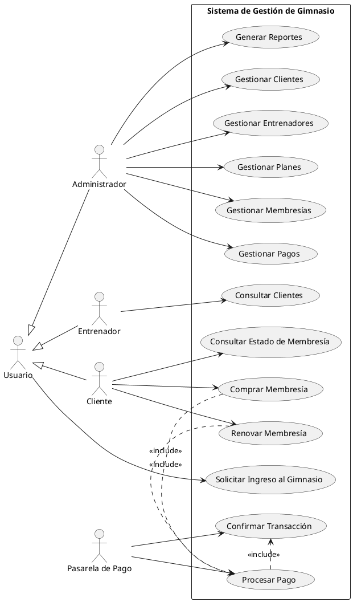
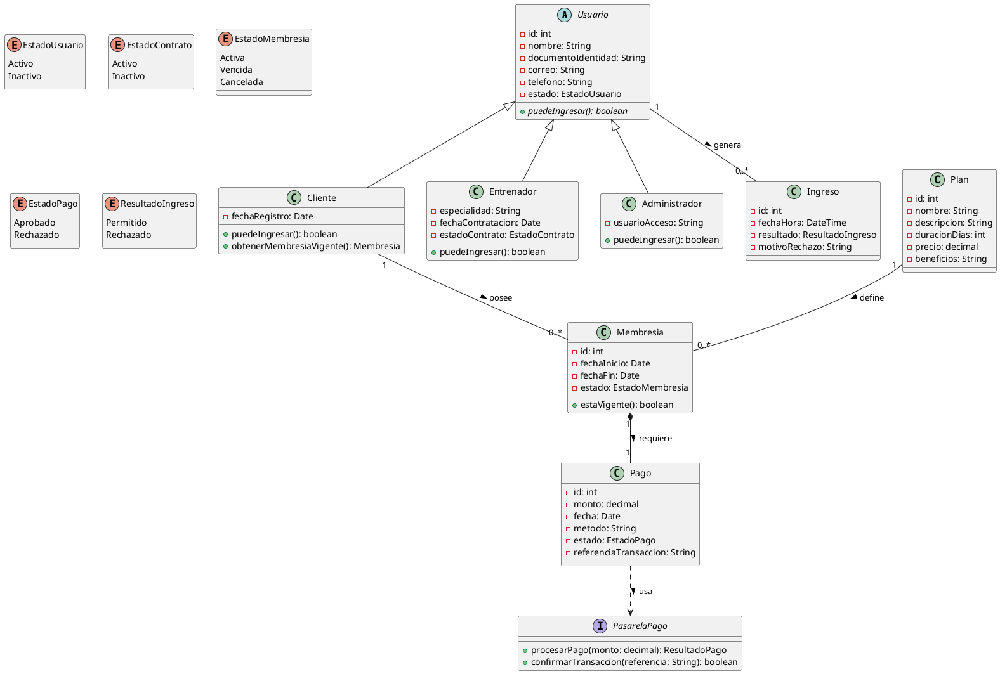
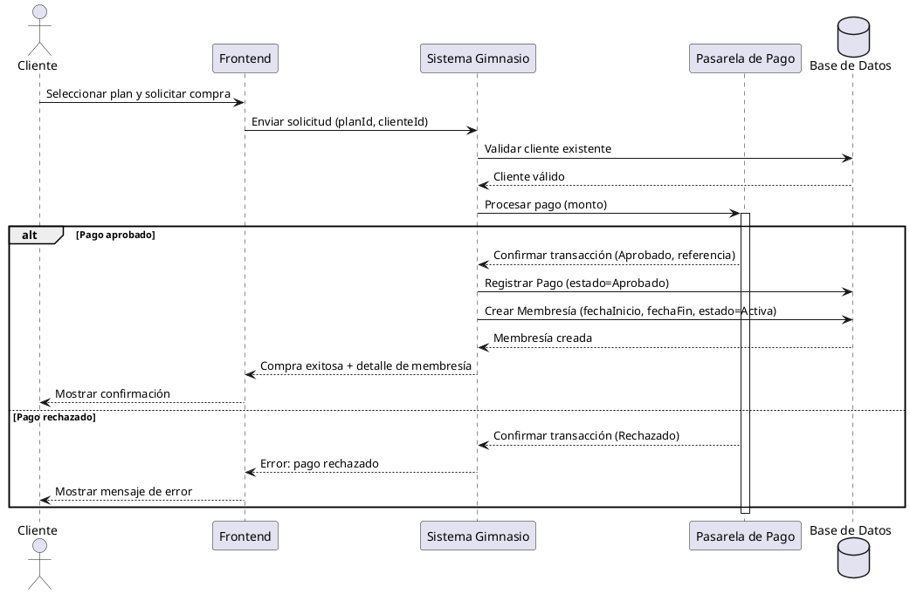
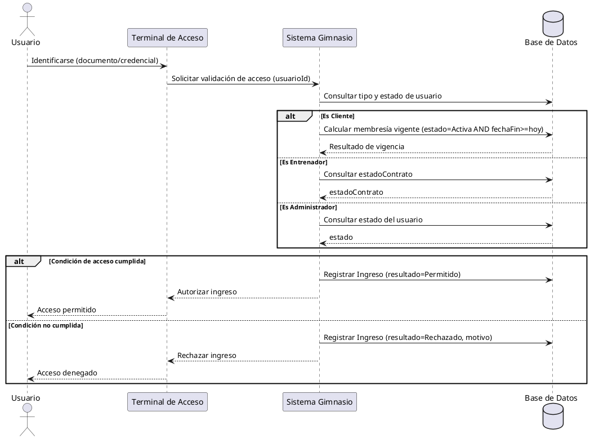

# Sistema de Administración de Membresías y Control de Ingreso a Gimnasio

## 1. Descripción del sistema

El sistema permite administrar un gimnasio: clientes, entrenadores, planes, membresías, pagos y control de ingreso. Antes de permitir el acceso, se valida que la membresía del cliente esté vigente.

**Actores:**
- **Administrador**: gestiona clientes, entrenadores, planes, membresías, pagos y reportes.
- **Entrenador**: consulta clientes.
- **Cliente**: compra o renueva su membresía, consulta su estado e ingresa al gimnasio.
- **Pasarela de Pago**: sistema externo que procesa y confirma los pagos.

**Reglas principales:**
- Cada compra o renovación genera una nueva membresía (se conserva el historial).
- La membresía solo se crea si el pago fue aprobado.
- Para ingresar: el cliente necesita membresía vigente, el entrenador necesita contrato activo y el administrador debe estar activo.

---

## 2. Diagrama de Casos de Uso

---

## 3. Diagrama de Clases

---

## 4. Diagrama de Secuencia: Compra de Membresía

---

## 5. Diagrama de Secuencia: Control de Ingreso al Gimnasio

