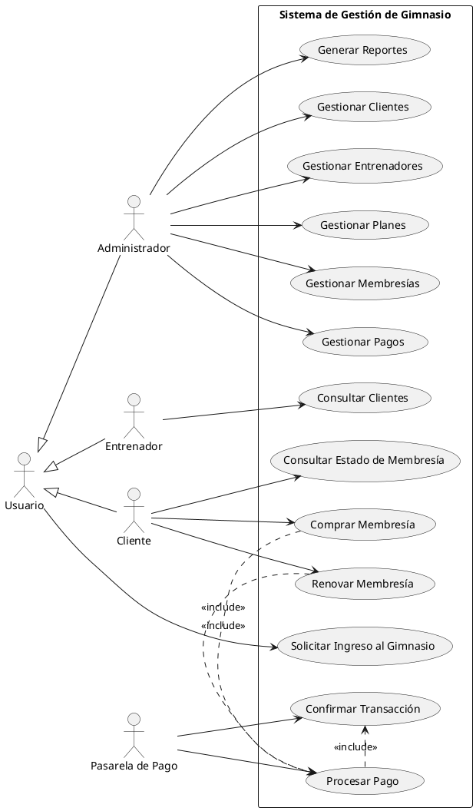
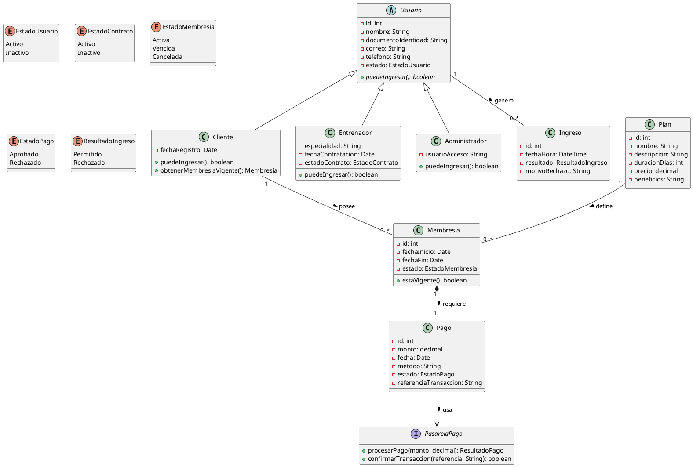
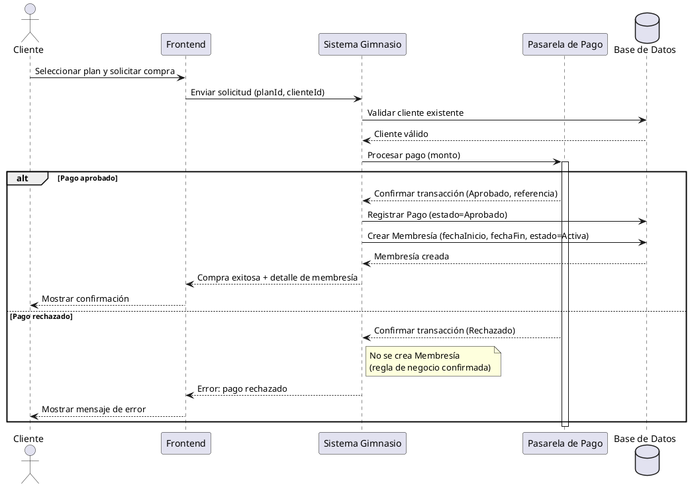
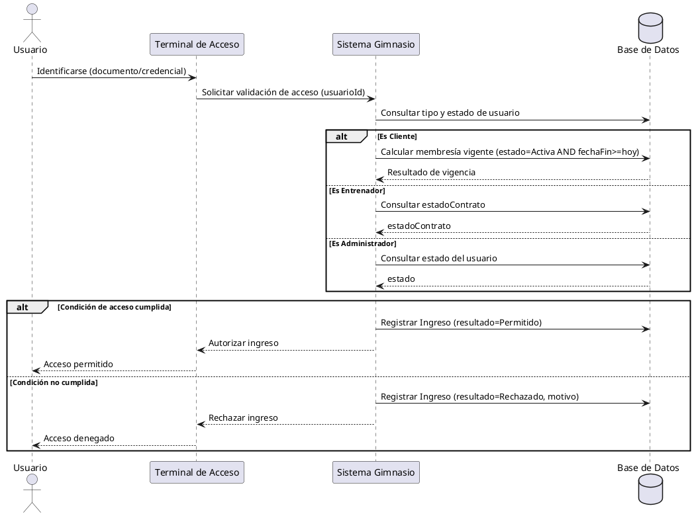
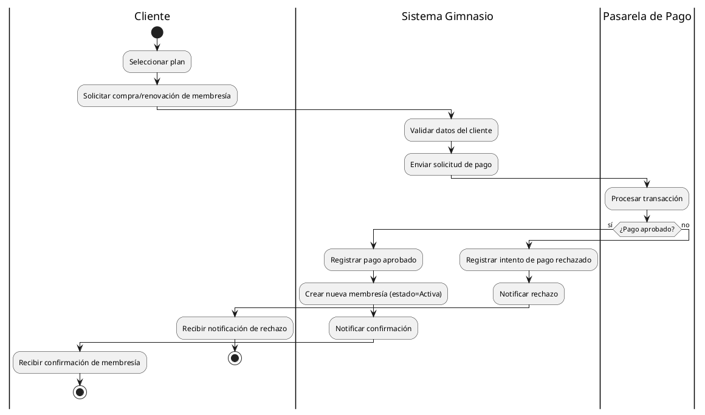
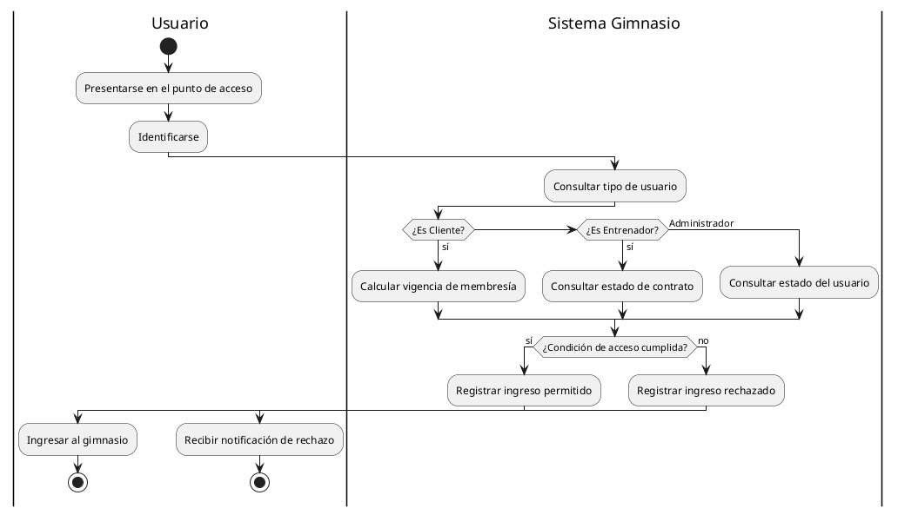

# Sistema de Administración de Membresías y Control de Ingreso a Gimnasio

Documento de análisis y diseño: modelo de dominio, casos de uso, clases, secuencia y BPMN (PlantUML).

> Alcance actual: **NO incluye Rutinas ni Ejercicios** (se dejarán para una fase posterior).

---

## Índice

1. [Contexto del sistema](#1-contexto-del-sistema)
2. [Modelo de dominio (aprobado)](#2-modelo-de-dominio-aprobado)
3. [Reglas de negocio consolidadas](#3-reglas-de-negocio-consolidadas)
4. [Diagrama de Casos de Uso](#4-diagrama-de-casos-de-uso)
5. [Diagrama de Clases](#5-diagrama-de-clases)
6. [Diagramas de Secuencia](#6-diagramas-de-secuencia)
7. [Diagramas BPMN (Activity Diagram con carriles)](#7-diagramas-bpmn-activity-diagram-con-carriles)
8. [Cómo visualizar estos diagramas](#8-cómo-visualizar-estos-diagramas)

---

## 1. Contexto del sistema

El sistema administra un gimnasio: clientes, entrenadores, planes, membresías, pagos y control de ingreso, verificando que la membresía del cliente esté vigente para permitir el acceso.

**Actores:**

- **Administrador**: gestiona clientes, entrenadores, planes, membresías, pagos y genera reportes.
- **Entrenador**: consulta clientes (rol reducido por ahora, sin rutinas/ejercicios).
- **Cliente**: compra/renueva membresías, consulta su estado, ingresa al gimnasio.
- **Pasarela de Pago**: sistema externo que procesa y confirma transacciones (no es un actor humano).

---

## 2. Modelo de dominio (aprobado)

### Jerarquía de herencia

```
Usuario (clase base abstracta)
 ├── Cliente
 ├── Entrenador
 └── Administrador
```

**Usuario** (atributos comunes): id, nombre, documento de identidad, correo, teléfono, estado (Activo/Inactivo).

- **Cliente** agrega: fechaRegistro
- **Entrenador** agrega: especialidad, fechaContratación, estadoContrato (Activo/Inactivo)
- **Administrador** agrega: usuario (credencial de acceso al sistema)

### Entidades de negocio

| Entidad | Atributos principales |
|---|---|
| **Plan** | id, nombre, descripción, duración, precio, beneficios |
| **Membresía** | id, fechaInicio, fechaFin, estado (Activa/Vencida/Cancelada), clienteId, planId |
| **Pago** | id, monto, fecha, método, estado (Aprobado/Rechazado), referenciaTransacciónPasarela |
| **Ingreso** | id, fecha/hora, resultado (Permitido/Rechazado), motivoRechazo, usuarioId |
| **PasarelaPago** | servicio externo: procesar pago, confirmar transacción (sin persistencia en el dominio) |

### Relaciones

| Relación | Cardinalidad | Naturaleza |
|---|---|---|
| Usuario → Cliente / Entrenador / Administrador | — | Herencia |
| Cliente — Membresía | 1 a 0..N | Asociación (historial completo) |
| Plan — Membresía | 1 a 0..N | Asociación |
| Membresía — Pago | 1 a 1 | Composición (no existe una sin la otra) |
| Usuario — Ingreso | 1 a 0..N | Asociación (aplica a cualquier rol) |
| Sistema — PasarelaPago | — | Dependencia (servicio externo) |

---

## 3. Reglas de negocio consolidadas

1. Cada compra o renovación genera una **nueva** Membresía (se conserva historial completo del cliente).
2. Una Membresía **solo existe** si el Pago asociado fue **Aprobado**. Un pago rechazado no genera Membresía.
3. La **membresía vigente** de un cliente se calcula dinámicamente: `estado = Activa` y `fechaFin >= fecha actual` (no se guarda un campo fijo de "membresía actual").
4. El control de **Ingreso aplica a cualquier Usuario** (Cliente, Entrenador, Administrador), pero la validación cambia según el rol:
   - **Cliente** → requiere membresía vigente.
   - **Entrenador** → requiere `estadoContrato = Activo`.
   - **Administrador** → requiere `estado = Activo`.
5. El Pago tiene únicamente dos estados finales: **Aprobado** o **Rechazado** (sin estado intermedio "Pendiente").

---

## 4. Diagrama de Casos de Uso

**Notación:** PlantUML



**Notas de diseño:**

- `Usuario` es un actor abstracto del cual heredan `Cliente`, `Entrenador` y `Administrador`, ya que el caso de uso "Solicitar Ingreso al Gimnasio" aplica a los tres roles.
- Se usa `<<include>>` (no `<<extend>>`) entre Comprar/Renovar Membresía y Procesar Pago, porque el pago **siempre** es obligatorio en esos flujos, nunca opcional.

---

## 5. Diagrama de Clases

**Notación:** PlantUML



**Notas de diseño:**

- `Usuario` es abstracta, con el método polimórfico `puedeIngresar()` sobrescrito distinto en cada subclase.
- La composición estricta `Membresia *-- Pago` (1 a 1) refleja la regla "no existe una sin la otra".
- `PasarelaPago` es una interfaz externa (dependencia), no una clase persistida del dominio.

---

## 6. Diagramas de Secuencia

### 6.1 Compra de Membresía

> La renovación sigue exactamente el mismo flujo (nueva membresía tras pago aprobado).



### 6.2 Control de Ingreso al Gimnasio



---

## 7. Diagramas BPMN (Activity Diagram con carriles)

> ⚠️ **Aclaración importante:** PlantUML no tiene un módulo de notación BPMN 2.0 formal (no genera los símbolos estándar de pools, tareas de servicio, eventos de mensaje, etc., según el estándar OMG BPMN). Lo que se muestra a continuación es un **Activity Diagram con carriles (`|Carril|`)**, la representación más cercana disponible en PlantUML. **No debe presentarse como un BPMN 2.0 certificado.** Para notación BPMN formal se recomienda Bizagi Modeler, Camunda Modeler o draw.io (con paleta BPMN).

### 7.1 Compra / Renovación de Membresía



### 7.2 Control de Ingreso al Gimnasio



---

## 8. Cómo visualizar estos diagramas

Todo el código está en **PlantUML**. Para renderizarlo, tu amigo puede usar cualquiera de estas opciones:

1. **Editor en línea oficial:** [https://www.plantuml.com/plantuml/uml/](https://www.plantuml.com/plantuml/uml/) — copiar y pegar el bloque de código (incluyendo `@startuml` / `@enduml`).
2. **Extensión de VS Code:** "PlantUML" (by jebbs) — permite previsualizar directamente los bloques de código.
3. **IntelliJ / otros IDEs:** existen plugins de PlantUML similares.

Basta con copiar cada bloque de código completo (desde `@startuml` hasta `@enduml`) en cualquiera de estas herramientas.

---

## Resumen de coherencia

Los cuatro artefactos (Casos de Uso, Clases, Secuencia y BPMN) comparten los mismos conceptos base: la generalización `Usuario`, la regla "sin pago aprobado no hay membresía", y el control de ingreso diferenciado por rol — sin contradicciones entre ellos.
